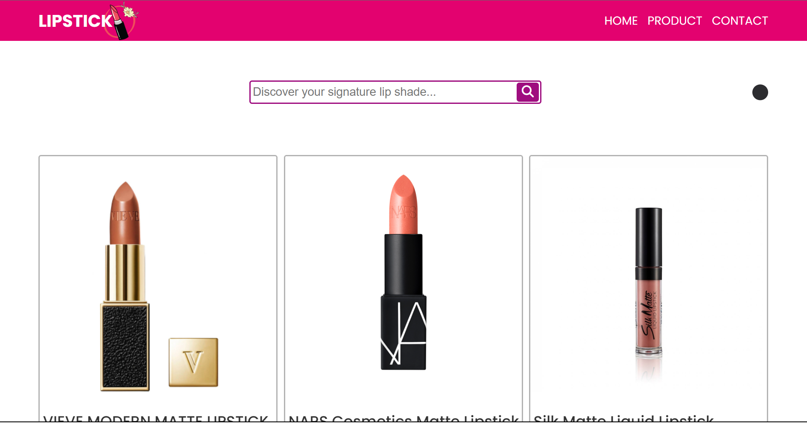
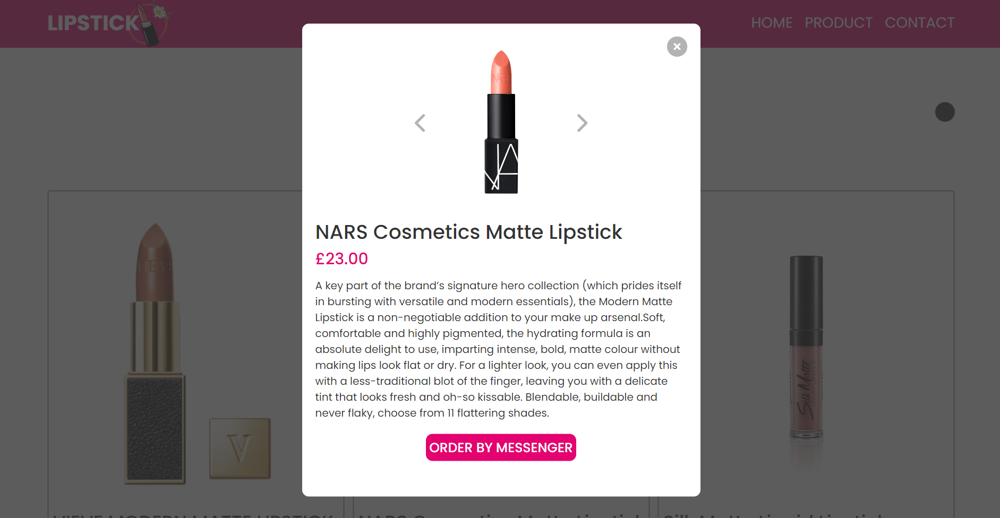
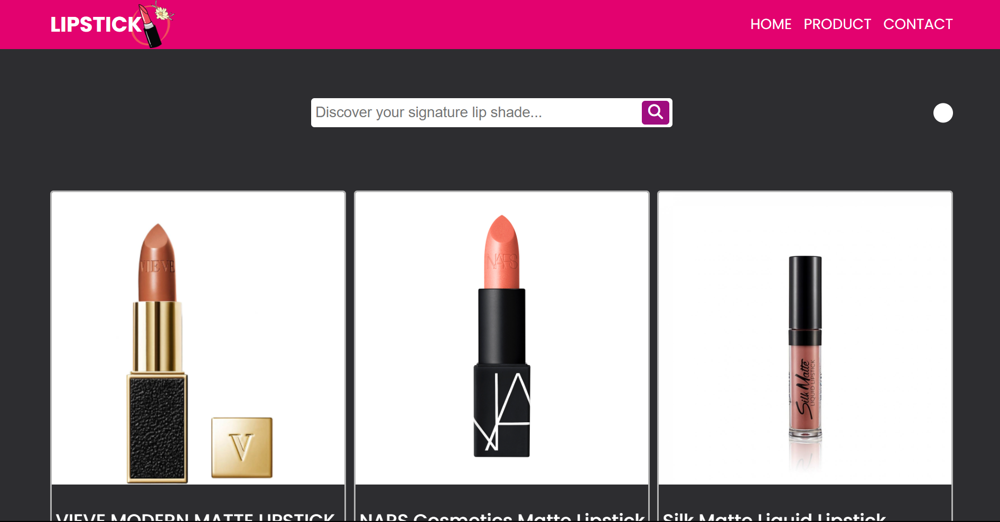
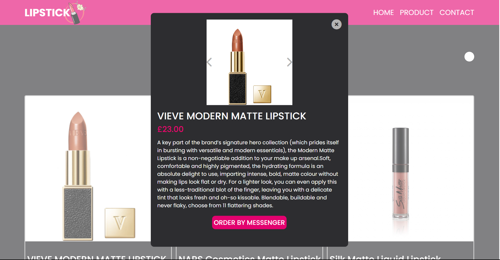

# LIPSTICK-WEBSITE

## INTRODUCTION

This is a static website built using HTML, CSS, and JavaScript.  
It has several functions, such as product search, viewing more information about products by clicking on them, and toggling between light mode and dark mode.

## THE INTERFACE OF WEBSITE

### LIGHT MODE:

### DARK MODE:

Click the black circle button to switch from light mode to dark mode.

## TO SEE THE FULL WEBSITE:

To experience the complete website, you can either download this project and open the 'index.html' file, or you can preview it [HERE](https://lipstickwebsite.netlify.app/).
